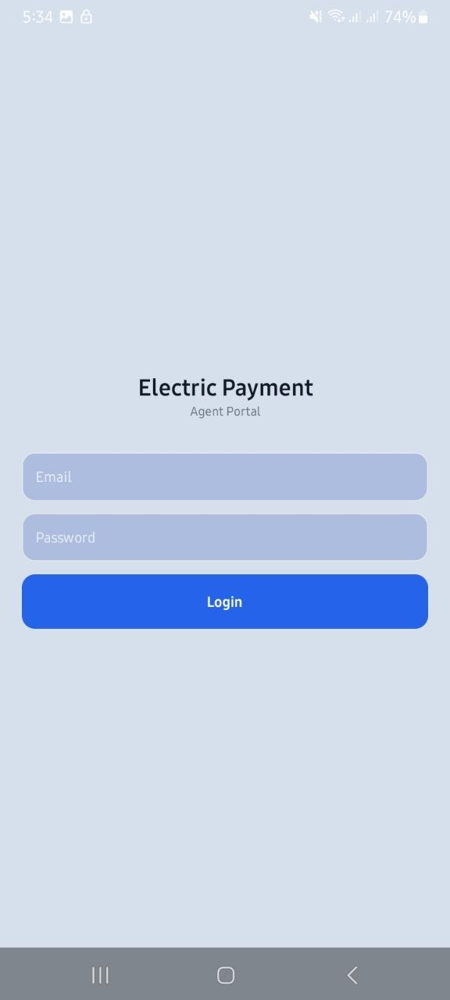
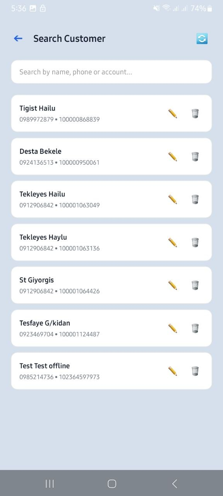
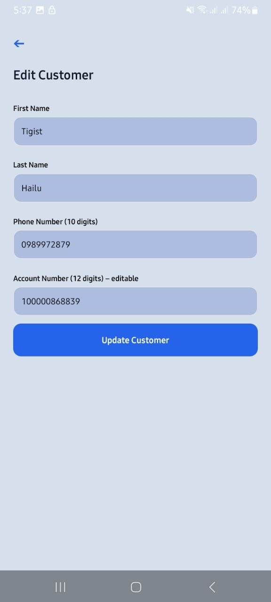
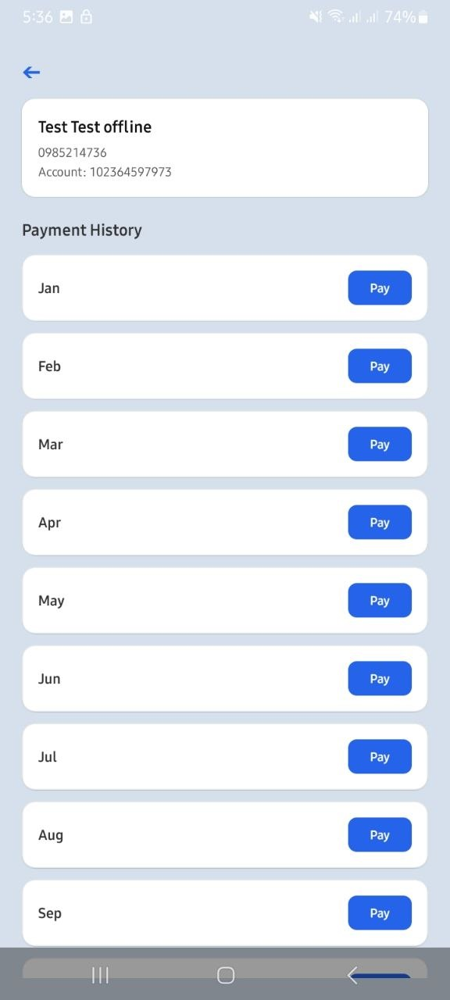
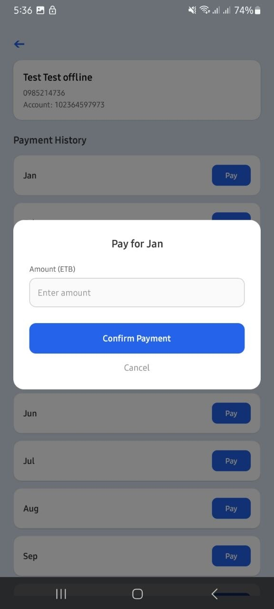
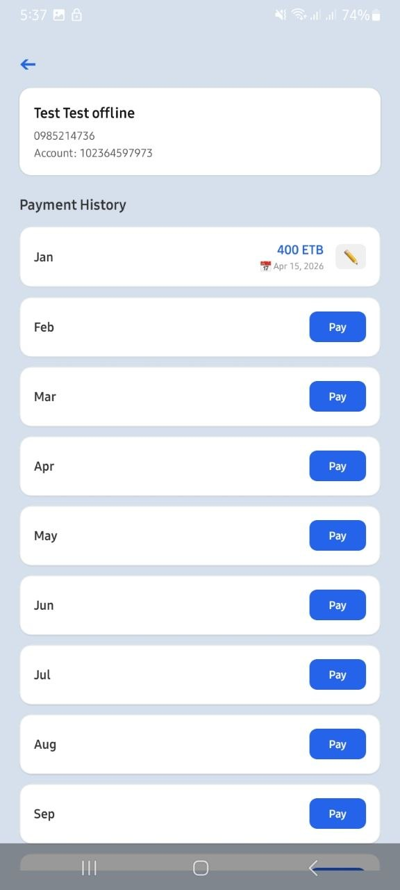
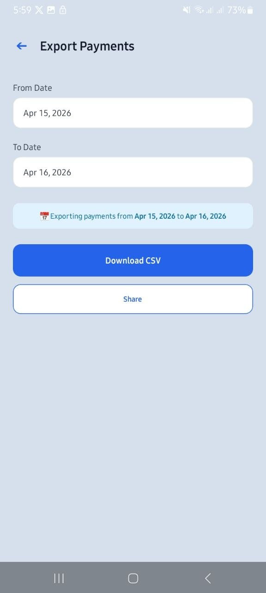

#  Electric Payment Agent App

A mobile application designed to digitize and simplify electricity bill collection for agents. This app replaces manual paper-based systems with a fast, reliable, and transparent digital solution.

---

## 📱 Overview

In many areas, electricity payments are still recorded manually on paper. This leads to:

* Slow customer lookup
* Risk of data loss
* Lack of transparency
* Difficult reporting

This app solves those problems by providing a **mobile-first digital payment system** for agents.

---

## 🚀 Features (MVP)

### 👤 Agent Authentication

* Secure login using Email & password

### 👥 Customer Management

* Register new customers
* Store:

  * Full Name
  * Phone Number
  * Contract Account Number

### 🔍 Search Customers

* Search by:

  * Name
  * Phone number
  * Contract Account number

### 💳 Payment Tracking

* Monthly payment system (Jan → Dec)
* Record:

  * Paid amount
  * Payment date
* Status:

  * Paid / Unpaid
* Edit incorrect payments

### 📊 Export Reports

* Export payments within date range
* Generate CSV file
* Share or download report

### ☁️ Cloud Storage (Firebase)

* Data stored securely in Firestore
* Real-time and persistent

---

## 🧱 Tech Stack

### 📱 Frontend

* React Native (Expo)
* TypeScript
* Expo Router

### ☁️ Backend (Serverless)

* Firebase Firestore

### 📦 Other Tools

* Expo EAS Build (APK generation)
* AsyncStorage (initial local storage)

---

## 📂 Project Structure

```
agent-app/
│
├── app/                 # Screens (Expo Router)
│   ├── (auth)/login
│   ├── dashboard
│   ├── register
│   ├── search
│   ├── customer-detail
│   └── export
│
├── components/          # Reusable UI components
├── constants/           # Colors, styles
├── services/            # Firebase + data logic
│   ├── firebase/
│   ├── customerService.js
│   └── paymentService.js
│
├── assets/              # Images, icons
└── eas.json             # Build configuration
```

---

## ⚙️ Installation

```bash
# Clone the project
git clone https://github.com/NegedeTekleyes/E-Payment.git
# Navigate to project
cd agent-app

# Install dependencies
npm install

# Start development server
npx expo start
```

---

## 🔥 Build APK

```bash
eas build --platform android --profile production
```

---

## 🔐 Firebase Setup

1. Create a Firebase project
2. Enable Firestore Database (Test Mode)
3. Add Web App
4. Copy config into:

```
services/firebase/config.js
```

---

## 📸 Screenshots

---- 🔐 App Screen


---- 🔐 Login Screen


---- 📊 Dashboard


👤 Register Customer


---- 🔍 Search Customer


---- 🔍 Update Customer


---- 💳 Payment Detail

---- 💳 Payment Detail

---- 💳 Payment Detail


---- 📤 Export Payments



---

## 🎯 Problem Solved

This application solves real-world challenges:

* ❌ Manual paper-based tracking
* ❌ Data loss risk
* ❌ Time-consuming reporting
* ❌ Payment disputes

✅ Provides:

* Digital records
* Fast search
* Transparent payment history
* Easy reporting
* offline support

---

## 🚀 Future Improvements

* Admin dashboard (web)
* SMS receipt for customers
* Multi-agent support
* Analytics dashboard

---

## 👨‍💻 Author

## Negede Tekleyes**

* Full-Stack Developer (React, Next.js, React Native)
* GitHub: <https://github.com/NegedeTekleyes>
* LinkedIn: <https://linkedin.com/in/negede-tekleyes>

---

## 💡 Motivation

This project is inspired by real-world challenges in Ethiopia where many services still rely on manual systems. The goal is to build scalable, affordable, and impactful digital solutions.

---

## ⭐ Show Your Support

If you like this project:

* ⭐ Star the repo
* 🍴 Fork it
* 📢 Share it

---

## 📄 License

This project is open-source and available under the MIT License.
